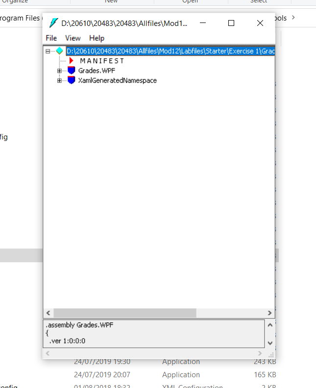
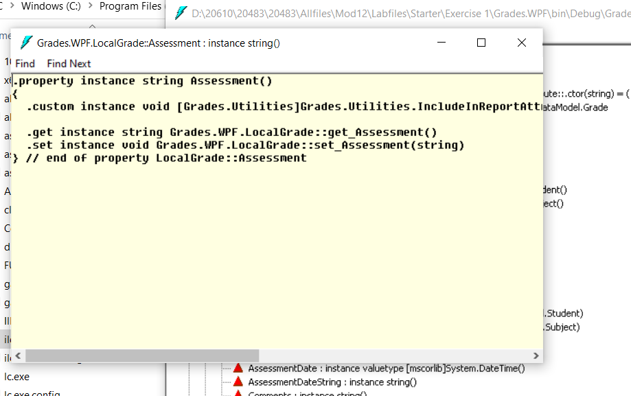
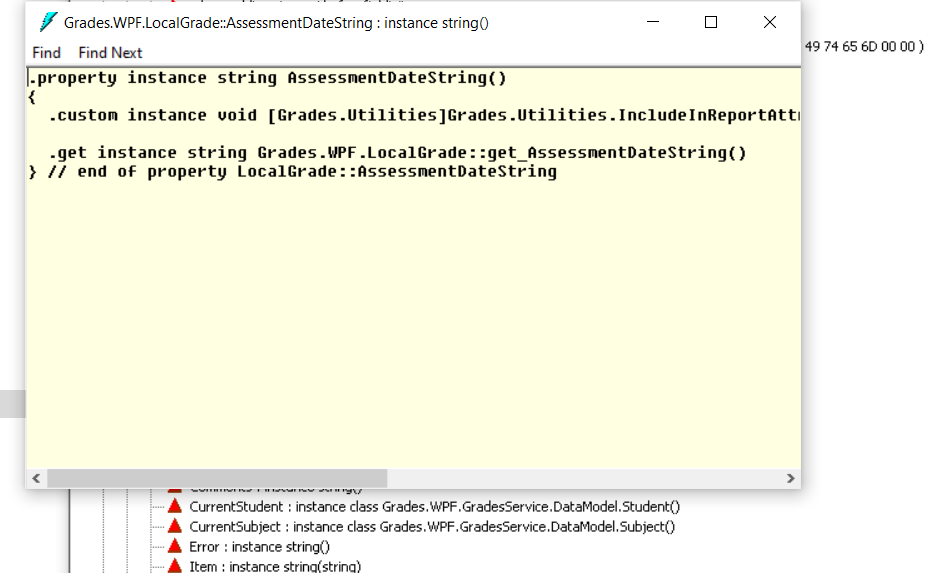
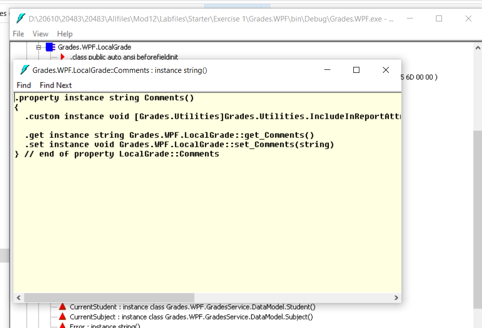

1. **Nombres y apellidos:** Carola Casais Recondo
2. **Fecha:** Lunes 16 de noviembre de 2020
3. **Resumen del Ejercicio:**  El objetivo de este ejercicio es crear y aplicar el atributo IncludeInReport.    
ara ello usamos IL DASM:       
 
 En el método **Assessment** , verificamos que en el **.custom instance void [Grades.Utilities]Grades.Utilities.IncludeInReportAttribute::.ctor()** el código está presente:    
    
 En la ventana **Grades.WPF.LocalGrade::AssessmentDateString : instance string()** en el método **AssessmentDateString** , verificamos que el código **.custom instance void [Grades.Utilities]Grades.Utilities.IncludeInReportAttribute::.ctor()** esta ahí:   
    
 En la ventana **Grades.WPF.LocalGrade::Comments : instance string()** , el método **Comments** verifica que el código **.custom instance void [Grades.Utilities]Grades.Utilities.IncludeInReportAttribute::.ctor()** está ahí.    
  
 

4. **Dificultad o problemas presentados y como se resolvieron:** No hubo dificultades en este ejercicio.
