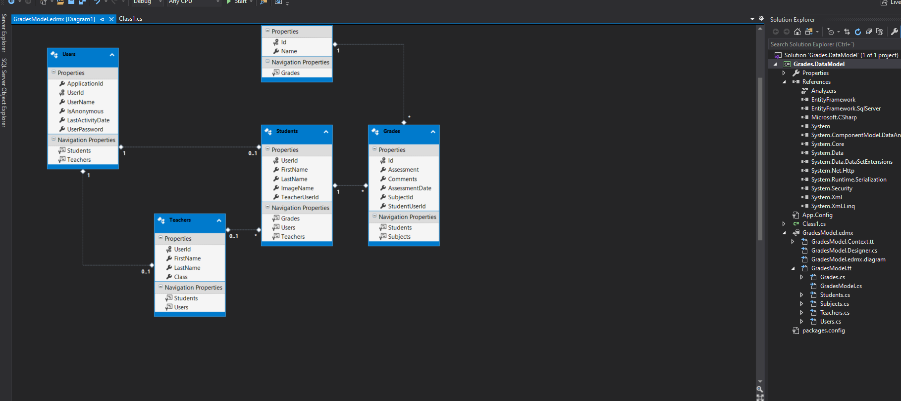

1. **Nombres y apellidos:** Carola Casais Recondo   
2. **Fecha:** Lunes 19 de octubre de 2020
3. **Resumen del Ejercicio:** El objetivo de este ejercicioe es generar un EDM mediante una table de la base de datos que estamos usando (SchoolGradesDB).  
Un Entity Data Model (un conjunto de conceptos que describen la estructura de los datos, independientemente del formato en el que estén almacenados. EDM se basa en el modelo entidad-relación (Entity-Relationship Model) descrito por Peter Chen en 1976, pero también incorpora nuevas funciones y amplía sus usos tradicionales.). Para ello creamos un ADO.NET Entity Data Model.
4. **Dificultad o problemas presentados y como se resolvieron:** No hubo dificultades en este ejercicio.

