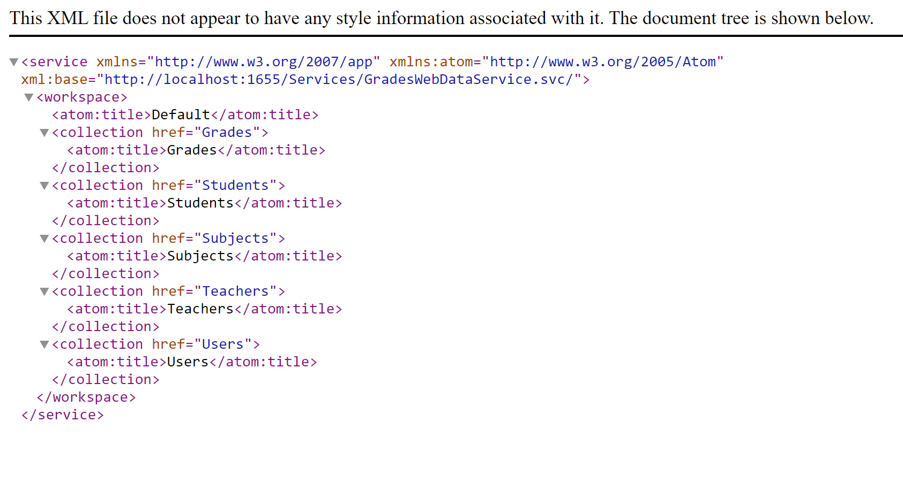

1. **Nombres y apellidos:** Carola Casais Recondo
2. **Fecha:** Lunes 19 de octubre de 2020
3. **Resumen del Ejercicio:** El objetivo de este ejercicio es crear un WCF para la base de datos SchoolGrades tal y como se ve en la imagen.
4. **Dificultad o problemas presentados y como se resolvieron:** No hubo dificultades en este ejercicio.

